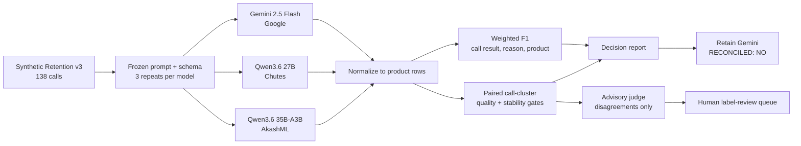

# Experiment 7 handoff

- **Recorded:** 2026-08-08
- **Application:** Retention
- **Data:** synthetic Thai `retention_v3` only
- **Decision:** retain Gemini as the reference for now
- **Migration status:** `INCONCLUSIVE` / `RECONCILED: NO`

## Answer first

Experiment 7 completed successfully as an evaluation run: all three model arms produced
414/414 parse-valid responses, the scorer completed, and the independent advisory judge
returned 360 opinions with no transport or identity failures. It did **not** establish that
either Qwen candidate is safe to replace Gemini.

- Qwen3.6 27B had the best call-result F1 (0.969) and lower reported generation cost than
  Gemini, but changed its exact answer across replicates on 129 of 138 calls. The binding
  decision was `FAIL` on stability.
- Qwen3.6 35B-A3B was cheapest, but trailed Gemini on all three scored dimensions and was
  unstable on 130 of 138 calls. Its decision was `FAIL` on quality and stability.
- The LLM judge is an advisory audit of disagreements. It surfaced 38 possible ground-truth
  errors for human review; it neither changes F1 nor picks a winning model.

This is useful screening evidence on a mock evaluation set, not a production migration
verdict. Production-shaped data, internal-GPU execution, and reconciliation against the
live Gemini fact-check report remain outstanding.

## What was tested

| Control | Experiment 7 setting |
|---|---|
| Testset | 138 synthetic calls; 150 normalized product rows |
| Repeats | 3 identical calls per model and item |
| Calls | 414 per model; 1,242 full-arm calls total |
| Prompt | `v9_16_base`; SHA-256 `968a2974...b4eee` |
| Decoding | temperature 0, top-p 0, seed 0, max tokens 8,000 |
| Scored dimensions | call result, reason, product |
| Aggregate display | weighted F1 from replicate 1 |
| Paired decision unit | one independent call cluster per dimension |
| Stability | exact structured response agreement across all 3 replicates |
| Judge | Gemma 4 31B IT, CoreWeave, reasoning off; disagreements only |
| Load probe | excluded from this experiment |

The exact prompt is assembled from
[`retention_wrapper.txt`](../src/evalgen/prompts/retention_wrapper.txt) and
[`retention_v9_16_body.txt`](../src/evalgen/prompts/retention_v9_16_body.txt); the
reviewed identity is pinned in [`manifest.json`](../src/evalgen/prompts/manifest.json).
Do not copy-edit the prompt inside a run command: a prompt change creates a new arm.



The committed [reproduction plan](../experiments/retention-e7.plan.json) is a call-free
draft built from the executed plan. The exact executed locked plan had SHA-256
`ea02cfacad27aea58c486213f0cfba304ca00b902050b983ed27f9cca244d3e1` and remains with
the private runtime evidence under `out/`.

## Main results

Weighted F1 is a descriptive summary for each scored dimension. The average below is an
unweighted descriptive mean only; it is not used by the decision gate.

| Metric | Gemini 2.5 Flash | Qwen3.6 27B | Qwen3.6 35B-A3B |
|---|---:|---:|---:|
| Call-result weighted F1 | 0.955 | **0.969** | 0.901 |
| Reason weighted F1 | **0.823** | 0.774 | 0.701 |
| Product weighted F1 | **0.960** | 0.942 | 0.888 |
| Descriptive mean | **0.913** | 0.895 | 0.830 |
| Parse-valid calls | 414/414 | 414/414 | 414/414 |
| Unstable calls | **0/138** | 129/138 | 130/138 |
| Decision vs Gemini | reference | `FAIL` stability | `FAIL` quality + stability |

### Why F1 alone does not decide this

The paired gate asks whether each candidate is non-inferior on the same call clusters and
whether repeated calls produce the same exact structured answer. Qwen3.6 27B's small
call-result advantage does not offset its binding stability failure. The harness does not
blend quality, latency, and price into one opaque score.

| Candidate vs Gemini | Call result | Reason | Product | Stability | Overall |
|---|---|---|---|---|---|
| Qwen3.6 27B | UNDERPOWERED (+1/5 discordant) | INDISTINGUISHABLE (-6/36) | UNDERPOWERED (-2/2) | **BEHIND (-129/129)** | **FAIL** |
| Qwen3.6 35B-A3B | **BEHIND (-11/15)** | **BEHIND (-27/41)** | **BEHIND (-10/10)** | **BEHIND (-130/130)** | **FAIL** |

## Operations and cost

Costs are provider-reported lower bounds, not procurement quotes. Latency and throughput
come from this workstation and selected hosted endpoints; they do not predict the future
internal-GPU deployment.

| Metric | Gemini 2.5 Flash | Qwen3.6 27B | Qwen3.6 35B-A3B |
|---|---:|---:|---:|
| Provider | Google | Chutes | AkashML |
| Input tokens | 1,237,746 | 1,645,842 | 1,645,842 |
| Output tokens | 84,459 | 100,992 | 99,418 |
| Generation cost | $0.475916 | $0.362492 | $0.211117 |
| Latency p50 | 1.830 s | 6.950 s | 2.779 s |
| Latency p95 | 3.227 s | 20.496 s | 8.995 s |
| Latency p99 | 3.669 s | 35.744 s | 16.337 s |
| Maximum latency | 3.953 s | 55.980 s | 20.645 s |
| Throughput | 2.011 calls/s | 0.450 calls/s | 1.123 calls/s |

The three full arms cost $1.049524. The judge cost $0.054399. Including the provider
qualification calls, the observed lower-bound spend was approximately $1.215310.

## Advisory LLM judge

The judge saw only scorer disagreements. `Possible GT error` means a human should inspect
the label and cited rule; it does not mean the ground truth is wrong.

| Pairing | Opinions | Usable | GT correct | Both defensible | Possible GT error | Unusable |
|---|---:|---:|---:|---:|---:|---:|
| Gemini vs Qwen3.6 27B | 99 | 88 | 32 | 44 | 12 | 11 |
| Gemini vs Qwen3.6 35B-A3B | 131 | 115 | 57 | 46 | 12 | 16 |
| Qwen3.6 27B vs 35B-A3B | 130 | 111 | 52 | 45 | 14 | 19 |
| **Total** | **360** | **314** | **141** | **135** | **38** | **46** |

## Team pickup checklist

1. Validate the committed plan without making model calls:

   ```bash
   PYTHONPATH=src python scripts/evalgen.py experiment-check \
     --plan experiments/retention-e7.plan.json
   ```

2. Read the machine-readable [aggregate summary](../experiments/evidence/retention-e7/summary.json).
3. Have Retention domain owners review the 38 possible-ground-truth-error items from the
   restricted judge bundle; do not move raw cited spans into Git.
4. Create a runtime manifest for the company GPU and run the same testset, prompt, schema,
   repeat count, and decision policy. Follow [TEAM_GPU_RUNBOOK.md](./TEAM_GPU_RUNBOOK.md).
5. Reconcile scoring against the application's live Gemini fact-check report before using
   the result in a migration decision.

## Evidence handling

Committed evidence is aggregate and synthetic-only. Raw model completions, transcripts,
and private judge records remain in ignored `out/` directories. The safe aggregate source
of truth for this handoff is
[`experiments/evidence/retention-e7/summary.json`](../experiments/evidence/retention-e7/summary.json).
