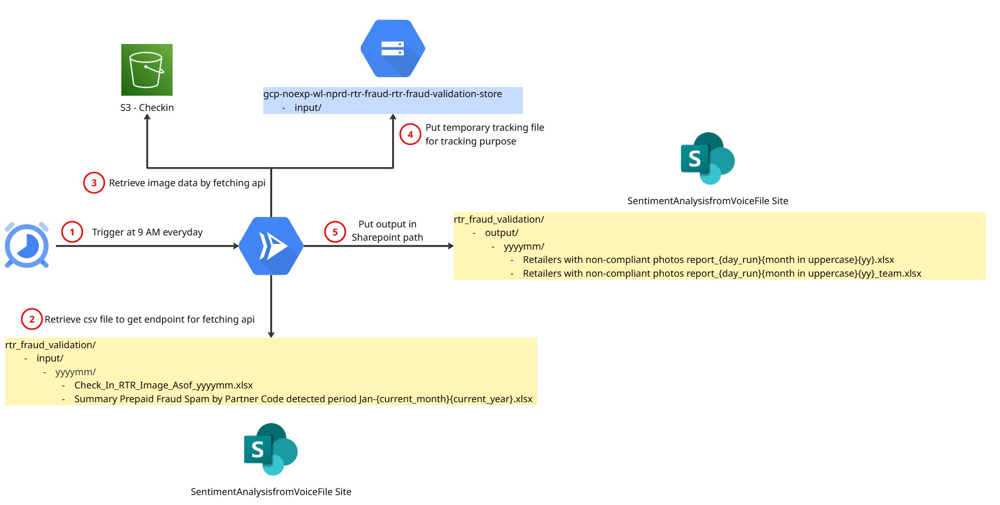

# RTR Fraud Validation

# Table of Contents
- [Overview](#overview)
- [High Level Architecture](#high-level-architecture)
- [Project Structure](#project-structure)
- [Setup](#setup)
- [Common Commands](#common-commands)
- [Deployment](#deployment)

# Overview

This project detects fraudulent retailer (RTR) shops registering to purchase SIM cards for scamming purposes. It uses Google Gemini 2.5 Flash to analyze shop images for fraud indicators: identifying closed businesses, detecting photos sourced from the internet rather than on-site photography, and flagging unrelated content. EXIF metadata extraction and image similarity (SSIM) provide additional signal.

The pipeline runs as a GCP Cloud Run Job scheduled on the 1st and 16th of each month. Results are published as Excel reports to SharePoint and delivered via email notification.

# High Level Architecture



The system consists of:
1. **Cloud Run Job** — executes the fraud validation pipeline
2. **GCS** — temporary file storage during pipeline execution
3. **Cloud Scheduler** — triggers the job on the 1st and 16th of each month at 16:00 (Asia/Jakarta)

**Cloud integrations:**
- **AWS S3** — source image storage
- **GCP** — GCS, Secret Manager, Vertex AI / Gemini, Cloud Run, Cloud Scheduler
- **Azure / Microsoft** — SharePoint for file I/O, Microsoft Graph API for email

# Project Structure

```
app/
├── main.py                    # Entry point: wires services and runs pipeline
├── share_log.py               # JSON-structured logging (use get_logger(__name__))
├── core/
│   ├── models.py              # Typed dataclasses: ShopRecord, ShopResult, PipelineConfig, etc.
│   └── interfaces.py          # Protocol definitions: StorageReader, AIValidator, Notifier, etc.
├── services/
│   ├── secret_service.py      # GCP Secret Manager + env fallback + in-memory cache
│   ├── s3_service.py          # boto3 wrapper for source image reads
│   ├── gcs_service.py         # gcsfs wrapper for temp file storage
│   ├── sharepoint_service.py  # MSAL-authenticated SharePoint client
│   ├── gemini_service.py      # Async Gemini API call with tenacity retry
│   └── email_service.py       # Microsoft Graph API email sender
├── processors/
│   ├── image_processor.py     # Pure image logic: EXIF, SSIM, GPS, same-photo label
│   ├── shop_processor.py      # Async per-shop orchestration (S3 + Gemini + ImageProcessor)
│   ├── report_builder.py      # Excel workbook and transaction/performance log builder
│   └── email_composer.py      # HTML email body and inline chart generation
├── pipeline/
│   └── fraud_pipeline.py      # FraudValidationPipeline: _ingest → _process_shops → _build_report → _publish → _notify → _cleanup
├── modules/
│   ├── fact_checker.py        # FactCheckerModule: evaluate model predictions vs. ground truth
│   └── sharepoint.py          # Thin shim delegating to SharePointService (for fact_checker compat)
└── utils/
    └── common.py              # YAML loading, ${ENV_VAR} + date template resolution, JSON schema $ref
```

**Configuration** (`config/`):
- `config/app/rtr_main.yaml` — input sources, output schemas
- `config/model_setting/rtr.yml` — Gemini parameters (temperature=0, seed=0)
- `config/system_prompt/rtr.yml` — multi-task detection prompt
- `config/fact_checker/rtr.yml` — ground truth sources and metric thresholds

# Setup

### 1. Install gcloud CLI
[gcloud CLI installation guide](https://cloud.google.com/sdk/docs/install-sdk)

### 2. Authenticate gcloud

```sh
gcloud auth login
gcloud auth application-default login
gcloud config set account VD${vendor_name}${number}@truecorp.co.th
gcloud config set project <project-id>
```

### 3. Install project dependencies

```sh
uv sync
```

# Common Commands

```sh
# Run the main fraud validation pipeline
uv run -m app.main

# Run the fact-checker evaluation module
uv run -m app.modules.fact_checker --config_path config/fact_checker/rtr.yml

# Run all tests
uv run pytest

# Run unit tests with verbose output
uv run pytest tests/unit/ -v

# Lint
uv run ruff check .

# Type check
uv run mypy .

# Export requirements.txt (for Docker builds)
uv export --no-hashes --no-dev -o .requirements.txt
```

# validata sonarqube 

```bash
# start container
docker run -d --name sonarqube -p 9000:9000 -p 9092:9092 sonarqube
```

```bash
# start analyze code with respect rule
. .venv/Scripts/activate

pysonar \
  --sonar-host-url=http://localhost:9000 \
  --sonar-token=sqp_f5f19270d9b77007bc497612d3bd4d1ab71339b1 \
  --sonar-project-key=RTR-FRAUD-VALIDATION
```

```bash
# run test case
pip install coverage pytest
python -m pytest tests   --cov=app   --cov-report=term   --cov-report=html:coverage-reports/coverage-html   --cov-report=xml:coverage-reports/coverage.xml
```

# Deployment

This project is deployed via Terraform (IaC). See [Deployment Step](deployment/README.md) for the full guide.

**Cloud Run Job specs:**
- Main job: 4 CPU, 8 GiB memory, 24 h timeout, scheduled 1st & 16th at 16:00 Asia/Jakarta
- Fact-checker job: 2 CPU, 4 GiB memory, scheduled 1st of month at 21:00

### Manual deploy via Cloud Build

**Non-prod:**
```sh
gcloud config set project <PROJECT_ID>
gcloud builds submit --config=./cloud_build/workflows/np_deployment.yaml .
```

**Prod:**
```sh
gcloud config set project <PROJECT_ID>
gcloud builds submit --config=./cloud_build/workflows/prod_deployment.yaml .
```

If the prod build fails with a permissions error:
1. Manually create the Cloud Run Job (select the Docker image from Artifact Registry in `gcp-noexp-wl-nprd-sentiment`)
2. Assign secret values from Secret Manager in `gcp-noexp-wl-prod-sentiment`
3. Create a Cloud Scheduler trigger pointing at the Cloud Run Job
